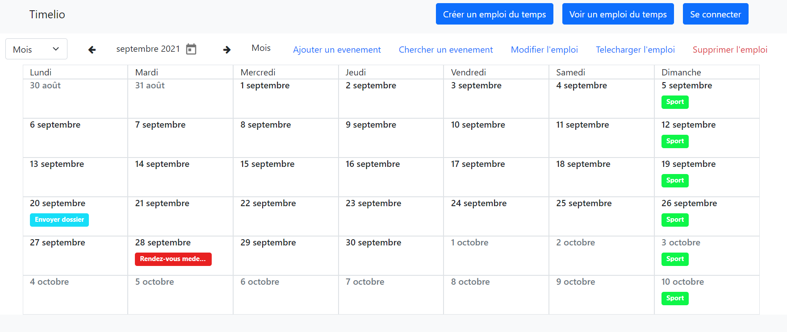
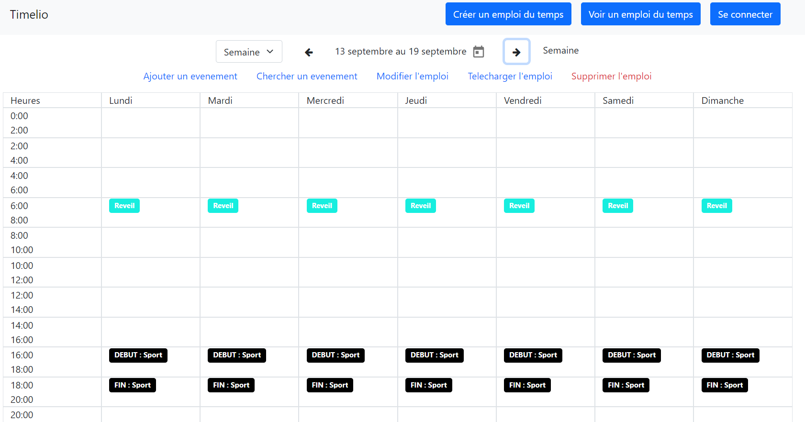
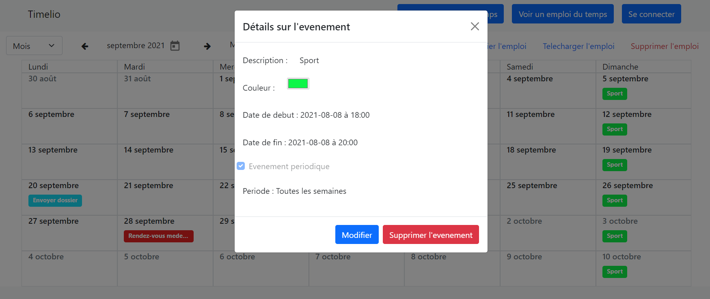
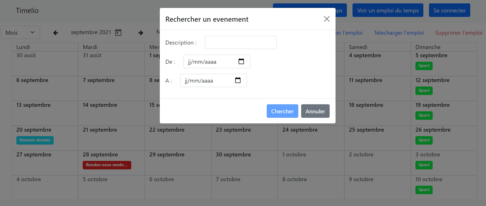

# Timelio :calendar:

## https://www.timelio.tech

Timelio est une application pour la création d'emploi (calendrier) avec des evenements.

&nbsp;&nbsp;
&nbsp;&nbsp;
&nbsp;&nbsp;
&nbsp;&nbsp;

## Fonctionalités
* Création d'un emploi du temps et ajout d'evenements 
* Visualisation sous forme de calendrier (par mois ou par semaine)
* Possibilité de création d'un compte pour rassembler ses calendriers ou les rendre privé
* Possibilité d'exporter le calendrier au format [ICalendar (.ics)](https://fr.wikipedia.org/wiki/ICalendar) pour l'importer sur d'autres plateformes (Outlook par exemple)

## Installation
Voir les dossier [back](timelio-back) et [front](timelio-front)